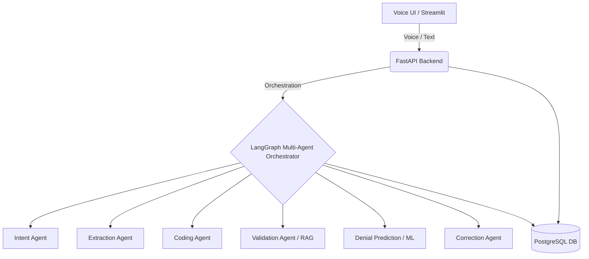

<div align="center">
  <h1>🏥 Voice-Driven Revenue Cycle Copilot</h1>
  <p><strong>A Production-Grade Multi-Agent AI System for Healthcare Billing Automation</strong></p>
  <p>
    
    
    
    
  </p>
</div>

---

## 📌 Overview
The **Voice-Driven Revenue Cycle Copilot** is an enterprise-ready AI system designed to automate and optimize healthcare billing workflows. It shifts healthcare operations from passive, manual data entry to proactive, intelligent claim generation and denial prediction.

Using voice interaction, complex multi-agent reasoning, retrieval-augmented generation (RAG), and embedded machine learning, the platform allows doctors and billing staff to naturally speak their clinical notes and immediately receive a validated, coded, and risk-assessed medical claim.

## 🧠 Key Features
* 🎙️ **Voice Interface**: Real-time STT/TTS interaction (faster-whisper).
* 🤖 **Multi-Agent Orchestration**: Specialized LangGraph agents for Extraction, Coding, Validation, Prediction, and Correction.
* 📄 **Automated Claim Generation**: Mappings to ICD-10/CPT codes on the fly.
* ⚠️ **Denial Prediction**: Embedded machine learning predicting likelihood of claim rejection.
* 📊 **Analytics Dashboard**: Streamlit-powered insights into AI agent decisions and revenue cycles.

## 🏗️ System Architecture

Our solution combines a highly scalable FastAPI backend with a dynamic Streamlit frontend, orchestrated by LangGraph, and backed by a robust PostgreSQL database.



## 🧩 Multi-Agent Design

| Agent | Responsibility |
| --- | --- |
| **Intent Agent** | Determines exactly what the user wants to accomplish. |
| **Extraction Agent** | Parses clinical input into structured medical data. |
| **Coding Agent** | Maps extracted conditions and procedures to standard ICD/CPT codes. |
| **Validation Agent** | Applies strict healthcare billing rules and compliance checks via RAG. |
| **Prediction Agent** | Scikit-Learn/XGBoost powered engine forecasting claim denial probability. |
| **Correction Agent** | Proposes actionable fixes prior to claim submission. |
| **Explanation Agent**| Generates human-readable rationales for AI decisions and confidence scores. |

## 🔌 API Design Highlights
- `POST /voice/process`: Handles byte-stream voice input and returns structured outputs.
- `POST /claims/generate`: Turns text into fully structured medical claim JSON.
- `POST /claims/predict-denial`: Specialized endpoint evaluating claim risk.
- `GET /analytics`: Exposes metrics on system latency and agent success rates.

## 🚀 Quick Start (Dockerized Production Stack)

We use Docker Compose to manage our robust data layer and orchestrate services.

### Prerequisites
- Docker & Docker Compose
- Python 3.11+
- HuggingFace / OpenAI API keys (Configure in `.env`)

### Setup Execution
1. **Clone & Boot the Stack:**
    ```bash
    git clone https://github.com/yourusername/revenue-cycle-copilot.git
    cd revenue-cycle-copilot
    docker-compose up -d
    ```
2. **Install Backend Dependencies:**
    ```bash
    cd backend
    pip install -r requirements.txt
    uvicorn app.main:app --reload
    ```
3. **Run the Dashboard:**
    ```bash
    cd frontend
    pip install -r requirements.txt
    streamlit run ui_app.py
    ```

## 🗄️ Database Schemas (SQLAlchemy)
- `patients`: Core demographic data
- `claims`: Generated diagnoses and procedures
- `denials`: Risk predictions and ML scores
- `agent_logs`: *Key differentiator* – auditing every single API call and agent thought-process for transparent security.

## 🔐 Security & Compliance Focus
- HIPAA-inspired design constraints (anonymized data flow).
- Built-in Agent Logging ensuring zero black-box decision making.
- Role-based architectural boundaries.

---
*Developed as a demonstration of state-of-the-art applied Machine Learning and LLM Orchestration in Healthcare Operations.*
